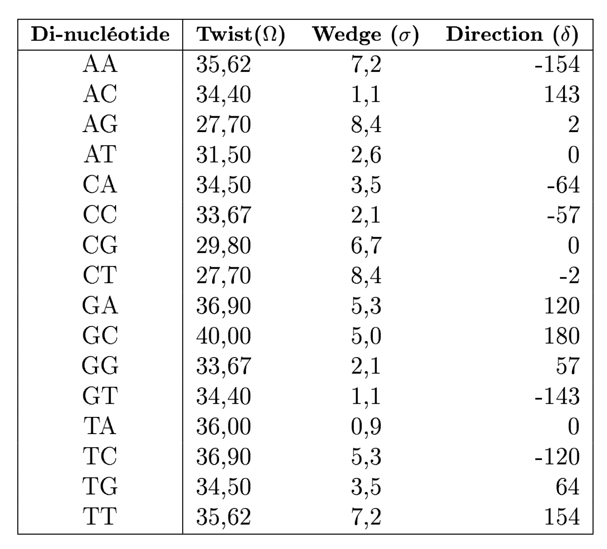
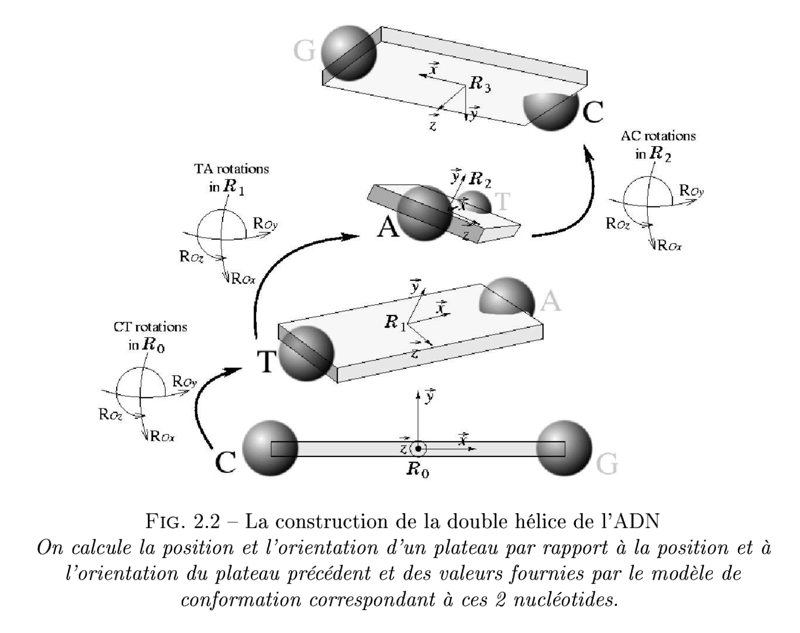

# ST2 (Théorie des Jeux) - EI Algorithmique Génétique

## Contexte
Toutes les cellules qui constituent la vie sur Terre comportent en elles une ou plusieurs molécules d'ADN qui sont le support de l'information génétique. Ces molécules, plus ou moins longues, sont composées d'une succession de nucléotides (ou bases : A, C, G et T) qui interagissent avec de nombreux éléments cellulaires et dont le positionnement dans l'espace joue un rôle important dans l'adaptation de la cellule à son environnement (chaleur, famine, stress...). Si les séquences d'ADN sont aujourd'hui très largement étudiées à travers leur séquence textuelle (succession de A, C, G et T), il est très instructif de les étudier à partir de leur trajectoire tri-dimensionnelle. En 1993, des biopysiciens ont établi un modèle de conformation 3D qui permet de transformer une suite de nucléotides (sous forme de lettres) en une trajectoire tri-dimensionnelle. Dès lors, il est possible de représenter toute séquence textuelle d'ADN en une trajectoire 3D.

## Problématique
Ce modèle ayant été développé pour de courtes séquences d'ADN nu, il ne prend pas en compte toutes les caractéristiques d'une longue chaîne au sein de la cellule (surenroulements, nucléosomes, interactions longue distance...). Par exemple, si on observe un chromosome bactérien (longue séquence d'ADN constituant une bactérie) ou un plasmide (petite séquence présente au sein des bactéries), on s'aperçoit que ce chromosome ou ce plasmide est circulaire, i.e. les deux extrémités ont été "collées" l'une à l'autre. Le modèle pré-cité ne rend pas compte de ce phénomène lorsque l'on représente la trajectoire 3D d'un chromosome bactérien ou d'un plasmide.

## Énoncé
L'objectif de ce projet est de modifier le modèle de conformation 3D donné afin de rendre un plasmide circulaire. Pour cela, deux algorithmes seront développés :
- un recuit simulé, et
- un algorithme génétique

Ces algorithmes seront implantés en Python et structuré en classes (programmation orientée objet).

Le projet est à réaliser en groupes de 4 ou 5 personnes.

## Livrables

- le **code source** du programme avec son manuel utilisateur,
- le **rapport** décrivant le fonctionnement global de l'algorithme, la structuration du code ainsi que les paramètres choisis et les stratégies mises en place,
- la **soutenance** finale présentant le travail effectué.

## Évaluation

Seront évalués :

- la pertinence des choix effectués pour concevoir l'algorithme (paramètres, stratégies),
- la qualité du code (structuration, optimisation, commentaires),
- la généricité de l'algorithme,
- les tests unitaires ainsi que leur couverture,
- les résultats (qualité de la fermeture du chromosome étudié, temps d'exécution moyen...),
- la qualité et la clarté de la présentation orale du projet.

## Ressources

Sont fournis :

- le fichier <tt>Traj3D.py</tt> implémentant le moteur de calcul d'une trajectoire 3D,
- le fichier <tt>Rot_Table.py</tt> contenant la table de rotations (avec les écart-types) nécessaires au calcul d'une trajectoire 3D,
- le fichier <tt>Main.py</tt> illustrant un exemple d'utilisation de la classe Traj3D,
- deux fichiers <tt>.fasta</tt> contenant les séquences de deux plasmides de longueur différente (8 000 dans un cas et 180 000 dans l'autre).
- Exécution : <code>python -m 3dna --help</code>

